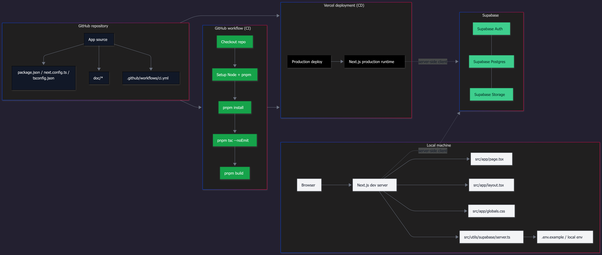

## 🧭 Project Meridian Nexus: A Mock Technical Case Study using Nextjs, Supabase, Vercel, CI/CD, PostgreSQL, and TypeScript

### 🎯 Objective

Also known as Project North Star, its objective is to build a unified Talent-as-a-Service (TaaS) platform for a fictional client, Meridian Nexus Group Ltd, to centralize the freelancer lifecycle (acquisition, training, delivery, payouts) into a single, auditable system.

### 🧩 Components

- Web application: Next.js App Router + React
- UI and motion: Tailwind CSS, Framer Motion, Lucide React
- Backend services: Supabase (PostgreSQL, Auth, Storage, RLS)
- API surface: Next.js route handlers for auth and profile flows
- Data model: profiles, talents, clients, contracts, feedback, contract vaults, vault files
- Deployment: Vercel-ready configuration and CI/CD hooks

### 🛑 Reason for Halting

Development friction increased over time with Supabase and Vercel, which became overwhelming for a single developer to sustain.

### 🔗 Developer Socials

- LinkedIn: [Miguel Justin](https://www.linkedin.com/in/migueljustin/)
- GitHub: [@migodbtc](https://github.com/migodbtc)
- Software Project Instagram: [@communeye.software](https://www.instagram.com/communeye.software/)

Open to collaboration, feedback, and project discussions.
